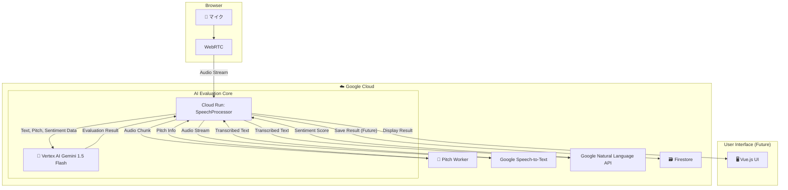

# 🚀 Edge Presence X (EP-X) - AI面接練習コーチシステム

[](https://cloud.google.com/)
[](https://cloud.google.com/vertex-ai)
[](https://cloud.google.com/natural-language)
[](https://opensource.org/licenses/MIT)

## 🎯 プロジェクト概要

EP-Xは、Google Cloud AI技術をフル活用したリアルタイムAI面接コーチです。
ユーザーの回答をその場で文字起こし・分析し、Gemini 1.5 Flashによる多角的なフィードバックを即座に提供することで、本番に強い面接スキル向上を徹底サポートします。

### ✨ 主要機能

- 🎤 **リアルタイム文字起こし** - `Cloud Speech-to-Text API` を利用し、低遅延で正確な文字起こしを実現
- 🧠 **多角的なAI評価** - `Vertex AI Gemini 1.5 Flash` が、STAR手法・論理性・熱意などを包括的に評価
- 💭 **感情分析** - `Google Cloud Natural Language API` が、発言の感情（ポジティブ/ネガティブ）をスコアリング
- 📈 **音程解析** - `PyAudio` を利用した音響分析で、声のトーンや抑揚の安定性を可視化
- 📋 **総合フィードバック** - 全ての分析結果を統合し、具体的で実践的な改善点を提示

## 🏗️ システムアーキテクチャ



## 🚀 クイックスタート

### 前提条件
- Python 3.9+
- Google Cloud Project (Speech-to-Text, Natural Language, Vertex AI の各APIが有効化済みであること)
- マイクが接続されたPC

### セットアップ
1.  **リポジトリをクローン**
    ```bash
    git clone https://github.com/[username]/edge-presence-x-mvp.git
    cd edge-presence-x-mvp
    ```

2.  **Python環境のセットアップ**
    ```bash
    # 仮想環境を作成 (推奨)
    python -m venv venv
    source venv/bin/activate  # Mac/Linux
    # venv\Scripts\activate    # Windows

    # 必要なライブラリをインストール
    pip install -r requirements.txt
    ```

3.  **Google Cloud認証設定**
    - Google Cloudでサービスアカウントを作成し、キー（JSONファイル）をダウンロードします。
    - ダウンロードしたキーファイルをプロジェクトの `config` フォルダなどに配置します。
    - `.env.example` を参考に `.env` ファイルを作成し、認証情報へのパスを設定します。

    **`.env` ファイルの例:**
    ```
    # --- EP-X Google Cloud Platform 環境変数 ---
    # このファイルをプロジェクトのルートに作成してください。
    # .gitignore に .env を追加して、キー情報がコミットされないように注意！

    # Google Cloudの認証情報 (サービスアカウントキー) のJSONファイルへのパス
    # この設定が一番重要！🔥
    GOOGLE_APPLICATION_CREDENTIALS=./config/your-service-account-key.json
    ```

4.  **手動テストの実行**
    ```bash
    python tests/manual_test_speech_processor.py
    ```
    マイクに向かって話しかけると、リアルタイムで文字起こしとAIによる評価がターミナルに表示されます。

## 🎖️ ハッカソン目標

**Google Cloud Japan AI Hackathon Vol.2** 参加プロジェクト
- ⏰ 24時間以内にMVP完成
- 📱 GitHub + Devpost提出 (MIT License)
- 🏆 AI Agent部門でのイノベーション評価

