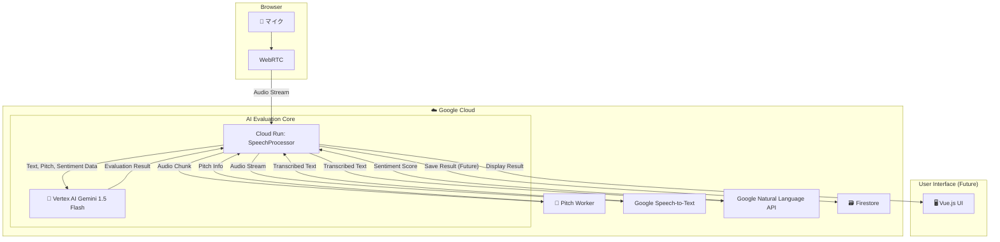

# 🚀 Edge Presence X (EP-X) - AI面接練習コーチシステム

[](https://cloud.google.com/)
[](https://cloud.google.com/vertex-ai)
[](https://cloud.google.com/natural-language)
[](https://opensource.org/licenses/MIT)

## 🎯 プロジェクト概要

EP-Xは、Google Cloud AI技術をフル活用したリアルタイムAI面接コーチです。
ユーザーの回答をその場で文字起こし・分析し、Gemini 1.5 Flashによる多角的なフィードバックを即座に提供することで、本番に強い面接スキル向上を徹底サポートします。

### ✨ 主要機能

- 🎤 **リアルタイム文字起こし** - `Cloud Speech-to-Text API` を利用し、低遅延で正確な文字起こしを実現
- 🧠 **多角的なAI評価** - `Vertex AI Gemini 1.5 Flash` が、STAR手法・論理性・熱意などを包括的に評価
- 💭 **感情分析** - `Google Cloud Natural Language API` が、発言の感情（ポジティブ/ネガティブ）をスコアリング
- 📈 **音程解析** - `PyAudio` を利用した音響分析で、声のトーンや抑揚の安定性を可視化
- 📋 **総合フィードバック** - 全ての分析結果を統合し、具体的で実践的な改善点を提示

## 🏗️ システムアーキテクチャ



## 🚀 クイックスタート

### 前提条件
- Python 3.12.x
  - **🔥 Windowsユーザーの方へ:** 2024年7月現在、一部のライブラリ(`Shapely`)がPython 3.13に対応するWindows向け完成品を配布していません。ビルドエラーを避けるため、**必ずPython 3.12.x系を使用してください。**
- Google Cloud Project (Speech-to-Text, Natural Language, Vertex AI の各APIが有効化済みであること)
- マイクが接続されたPC

### セットアップ
1.  **リポジトリをクローン**
    ```bash
    git clone https://github.com/[username]/edge-presence-x-mvp.git
    cd edge-presence-x-mvp
    ```

2.  **Python環境のセットアップ**
    ```bash
    # 仮想環境を作成 (推奨)
    python -m venv venv
    source venv/bin/activate  # Mac/Linux
    # venv\Scripts\activate    # Windows

    # 必要なライブラリをインストール
    pip install -r requirements.txt
    ```

3.  **フロントエンドのセットアップ (Node.js)**
    ```bash
    # Node.jsの依存関係をインストール
    npm install
    ```

### ✨ 審査員向け：Webアプリケーションの操作方法

このセクションでは、デプロイされたWebアプリケーションの基本的な使い方を説明します。

1.  **アプリケーションにアクセス**
    - **ローカルで実行する場合:**
      ```bash
      # 開発サーバーを起動
      npm run dev
      ```
      ターミナルに表示される `http://localhost:xxxx` のようなURLにアクセスしてください。
    - **デモURLがある場合:**
      提供されたデモURLにアクセスしてください。
    - 中央に表示される「面接を開始する」ボタンがEP-Xの入り口です。

2.  **マイクの使用を許可**
    - 「面接を開始する」ボタンをクリックすると、ブラウザからマイクの使用許可を求められます。
    - 機能の性質上、マイクへのアクセスが必須となりますので、「許可」を選択してください。

3.  **面接シミュレーション開始**
    - 許可すると、ボタンが赤色の「面接を終了する」に変わり、セッションが開始されます。
    - 何か話してみてください！自己紹介や、最近取り組んだことなど、自由なテーマでOKです。
    - 画面左側には、あなたの声がリアルタイムで文字起こしされていきます。

4.  **フィードバックの確認**
    - 話し終わったら、「面接を終了する」ボタンをクリックしてください。
    - セッションが終了し、数秒待つと画面右側にGemini 1.5 FlashによるSTARメソッドに基づいた評価カードが表示されます。
    - スコアに応じてカードの背景色が変わるようになっています。ぜひ色々な話し方を試してみてください！

---

5.  **Google Cloud認証設定 (🔥最重要🔥)**
    
    EP-XがGoogleのAIと話すためには、「サービスアカウントキー」という秘密の通行手形が必要です。
    以下の手順で、プログラムに通行手形の場所を教えてあげてください。

    1.  **サービスアカウントキーを用意する**
        - Google Cloudコンソールで、ご自身のプロジェクトのサービスアカウントキー（JSON形式）をダウンロードします。
        - まだ作成していない場合は、新しいサービスアカウントを作成し、キーを発行してください。

    2.  **キーファイルをプロジェクトに配置する**
        - ダウンロードしたキーファイル（例: `my-project-12345-abcdef.json`）の名前を、**`gcp-key.json`** に変更します。
        - 名前を変更した `gcp-key.json` ファイルを、このプロジェクトの **`config`** フォルダの中に置きます。

    3.  **`.env` ファイルでキーの場所を教える**
        - プロジェクトのルートディレクトリ（`package.json` がある場所）に、`.env.example` というファイルがあります。
        - これをコピーして、同じ場所に **`.env`** という名前のファイルを作成します。
        - `.env` ファイルの中身が以下のようになっていることを確認してください。

        ```env
        # Google Cloudの認証情報 (サービスアカウントキー) のJSONファイルへのパス
        # config/gcp-key.json を指していればOK！
        GOOGLE_APPLICATION_CREDENTIALS=./config/gcp-key.json
        ```

    > **💡ヒント:** なぜファイル名を `gcp-key.json` に変更するの？
    > このプロジェクトでは、みんなが同じ設定を使えるように、あらかじめプログラムが `gcp-key.json` という名前のファイルを探しに行くように作られています。こうすることで、「ファイル名、何にすればいいんだっけ？」と迷うことがなくなるんです！

6.  **アプリケーションの起動**

    お疲れ様でした！これで全ての準備が整いました。
    ターミナルを2つ開き、それぞれで以下のコマンドを実行して、EP-Xを起動しましょう！

    - **ターミナル① (バックエンド用):**
      ```bash
      # 仮想環境を有効化していることを確認してね！
      # (venv) or (.venv) みたいな表示が目印！
      python src/backend/main.py
      ```
      `Uvicorn running on http://0.0.0.0:8000...` と表示されたら成功です。

    - **ターミナル② (フロントエンド用):**
      ```bash
      npm run dev
      ```
      `Local: http://localhost:xxxx` とURLが表示されたら成功です。

7.  **動作確認**
    - ターミナル②に表示されたURLに、Webブラウザでアクセスしてください。
    - 「面接を開始する」ボタンが表示されれば、完璧です！

### 📚 (補足) バックエンド手動テストの実行
フロントエンドなしでバックエンドの動作だけを確認したい場合は、以下のコマンドを実行します。
```bash
python tests/manual_test_speech_processor.py
```
マイクに向かって話しかけると、リアルタイムで文字起こしとAIによる評価がターミナルに表示されます。

## 🎖️ ハッカソン目標

**Google Cloud Japan AI Hackathon Vol.2** 参加プロジェクト
- ⏰ 24時間以内にMVP完成
- 📱 GitHub + Devpost提出 (MIT License)
- 🏆 AI Agent部門でのイノベーション評価

